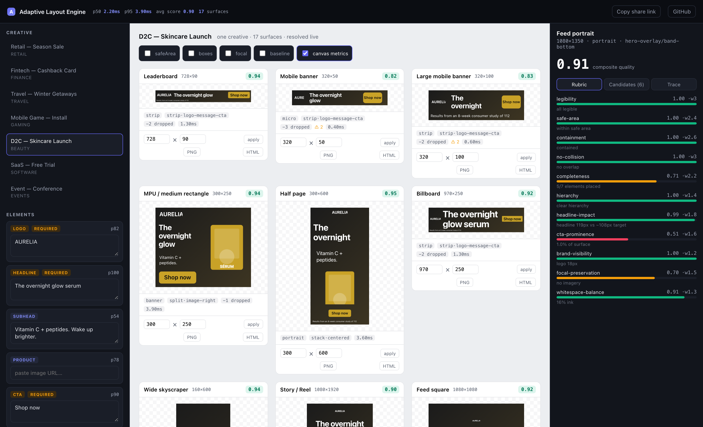
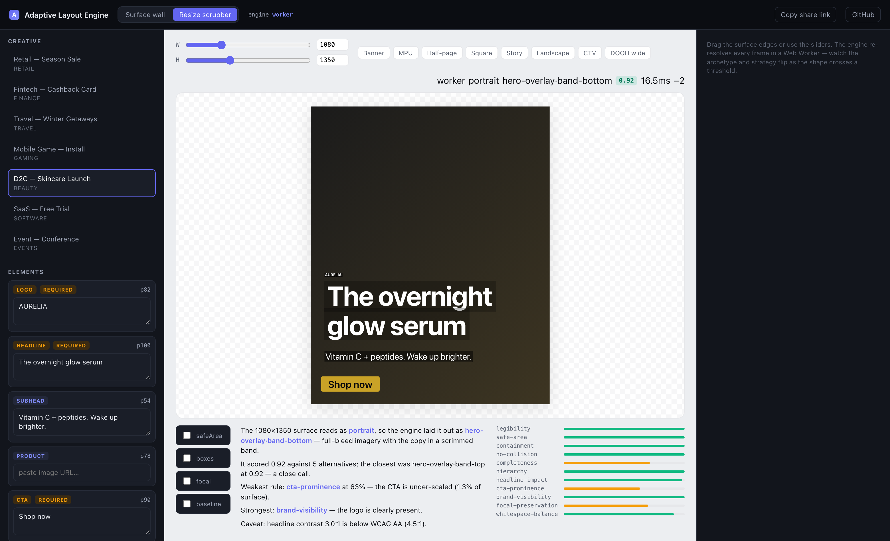

# Adaptive Layout Engine for Multi-Surface Ads

Author an ad creative **once**, resolve it onto **any surface** — a 320×50 mobile
banner, a 1080×1920 story, a 1920×1080 connected‑TV frame, a 3840×1080 DOOH pillar
— and get back a concrete, renderable layout plus a full explanation of every
decision the engine made.

**Live playground:** https://adaptive-layout-engine-omega.vercel.app
**Repo:** https://github.com/Thanush-24/adaptive-layout-engine



---

## The idea

Most "responsive ad" engines classify the surface and pick **one** layout
template for it. That breaks down at the edges: the template that suits a 300×250
rectangle is wrong for a 300×600 half‑page, and picking by aspect ratio alone
ignores whether the _content_ actually fits.

This engine treats layout as an **optimisation problem**:

```
classify surface → generate many candidate layouts → place + score every one
   → select the best → (if still weak) shed the lowest-priority element, retry
   → audit → emit layout + decision trace
```

Six strategies (`strip`, `stack`, `split`, `hero-overlay`, `sidebar`, `poster`)
each propose one or more candidate region maps. Every candidate is fully placed —
real font metrics, focal‑point‑aware image crops, contrast‑aware colour — and
graded against an **eleven‑rule rubric** (legibility, safe‑area, containment,
collisions, completeness, hierarchy, headline impact, CTA prominence, brand
visibility, focal preservation, whitespace balance). The highest weighted score
wins, and the whole tournament comes back in `layout.trace` — including a
plain‑English account of _why_.

### Two ways to see it work

**Surface wall** — one creative rendered across all 17 surfaces at once. Pick any
card for the inspector: composite score, the eleven‑rule breakdown, every
candidate the optimiser weighed, the degradation log, the audit warnings.

**Resize scrubber** — drag one surface from 50px to 3840px (sliders, drag‑handles,
or presets) and watch the engine re‑resolve _every frame_ in a Web Worker: the
archetype flips, the strategy changes, the layout re‑flows, the score updates.



### How this compares to a template‑selection engine

|                  | Template selection                | This engine                                                                |
| ---------------- | --------------------------------- | -------------------------------------------------------------------------- |
| Layout choice    | 1 template picked by aspect ratio | N candidates generated, scored, best selected                              |
| Explains itself  | a warnings list                   | every candidate + per‑rule breakdown + drop log + plain‑English narrative  |
| Type fitting     | binary‑search font size           | binary‑search **+** line‑break balancing **+** legibility floor            |
| Imagery          | focal point stored                | focal‑aware crop → CSS `object-position`, + auto colour / per‑line scrim   |
| Degradation      | drop lowest priority              | drop only when it _measurably raises the score_, each step traced          |
| Viewing distance | —                                 | near / mid / far drives the minimum legible px                             |
| Output           | in‑app render                     | React **+** framework‑agnostic HTML **+** SVG **+** PNG export **+** a CLI |
| Playground       | one surface, sliders              | 17‑surface wall + live resize scrubber, off‑thread, shareable URL          |
| Authoring        | typed object                      | a documented JSON DSL with a no‑throw validator                            |
| Tests            | a unit suite                      | invariant matrix + golden + property + SVG + CLI + visual regression       |

---

## Quickstart

```bash
npm install
npm run dev            # playground at http://localhost:5173
npm test               # 173 assertions
npm run bench          # engine throughput
npm run build          # production build (app + CLI) to dist/
npm run test:visual    # Playwright visual regression (needs a browser)
```

---

## Engine API

`src/engine` has **zero** React or DOM dependencies — it runs in Node, a Web
Worker, or a build step unchanged.

```ts
import { resolveLayout, SURFACES, narrate } from './src/engine'

const layout = resolveLayout(creative, SURFACES[0])

layout.placements // [{ id, role, rect, text?, image?, colors?, z }]
layout.score // 0..1 composite quality
layout.ruleScores // per-rule breakdown with weights
layout.dropped // elements shed, with reasons
layout.warnings // frame-breach / safe-area / sub-legible / severe-crop / …
layout.trace // archetype, every candidate + score, degradation steps, elapsedMs

narrate(layout) // string[] — "chose hero-overlay because the background scored
//                0.9 on focal preservation and the bottom band kept the
//                headline at 64px …"
```

### Authoring — the DSL

A creative is plain JSON. `parseCreative` validates loosely‑typed input, fills in
role‑derived defaults, and returns **either** a typed `Creative` **or** every
path‑anchored error and soft warning at once — it never throws.

```ts
import { parseCreative } from './src/engine'

const r = parseCreative(json)
if (!r.ok) r.errors.forEach((e) => console.error(`${e.path}: ${e.message}`))
else resolveLayout(r.creative, surface)
```

Roles carry layout intent (reading order, space weight, degradation priority) and
supply typography defaults, so a bare `{ role, content }` still resolves well.
`ale schema` prints the full shape.

### Rendering

```ts
import { renderToHtml } from './src/render/html' // -> self-contained HTML string
import { renderToSvg } from './src/render/svg' // -> standalone <svg> string
import { AdSurface } from './src/render/react/AdSurface' // -> <AdSurface layout={…} />
```

The React renderer also draws debug overlays (safe area, region boxes, focal
points, baseline grid) and animates elements to each re‑resolved layout. The HTML
and SVG renderers are dependency‑free, escape all content, and reproduce the
focal crop as pure CSS / SVG — usable in email, SSR, or a build step.

---

## CLI

`npm run build` also produces `dist/ale.mjs`, exposed as the `ale` bin.

```bash
ale render creative.json --surfaces all --format html,svg,json --out ads/ --explain
ale validate creative.json
ale surfaces          # list the 17 presets
ale schema            # print the creative DSL

  mpu              0.97  stack/centered
      The 300×250 surface reads as banner, so the engine laid it out as
      stack·centered — a vertical stack in reading order.
      It scored 0.97 against 5 alternatives; the closest was split·image-left
      at 0.95, which lost mainly on completeness — a close call.
  ...
  3 surface(s) × html+svg+json → ads/
  lowest score 0.89, 1 warning(s)
```

`render` writes a file per surface × format and exits non‑zero if any surface
scores below 0.55 — so it drops into a content pipeline as a quality gate.

---

## Architecture

```
src/engine/                 framework-agnostic — no React, no DOM
  types.ts                  Creative, AdElement, Surface, ResolvedLayout, Trace
  dsl.ts                    parseCreative() — JSON authoring format + validator
  surfaces.ts               17 presets + archetype classifier + legibility table
  defaults.ts               role-derived typography & priority
  geometry.ts               rect math (inset, breach, overlap, align)
  text/metrics.ts           Canvas measureText + deterministic table fallback
  text/fit.ts               largest-that-fits font size + line-break balancing
  image/focal.ts            focal-aware crop → object-fit / object-position
  image/color.ts            WCAG luminance / contrast / scrim / auto text colour
  layout/partition.ts       CSS-flex-like weighted track solver
  layout/strategies.ts      strip · stack · split · hero-overlay · sidebar · poster
  layout/candidates.ts      enumerate applicable strategies → LayoutCandidate[]
  layout/place.ts           place elements into regions; fit type & imagery
  score/rubric.ts           11 weighted rules → composite score
  degrade.ts                priority-ordered shed policy
  audit.ts                  post-hoc warnings
  narrate.ts                trace → plain-English account
  resolve.ts                the orchestrator (public entry point)

src/render/                 html.ts · svg.ts · react/AdSurface.tsx (+ overlays)
src/playground/             the Vercel app
  engine/                   the engine in a Web Worker + a latest-wins client
  App / SurfaceCard / Inspector / CreativeEditor / Scrubber
src/data/                   7 sample creatives, procedural SVG art (no external assets)
bin/ale.ts                  the CLI
tests/visual/               Playwright visual-regression suite
```

See [`ARCHITECTURE.md`](ARCHITECTURE.md) for the data‑flow walk‑through and the
design rationale.

### Determinism

`resolveLayout(creative, surface)` is a pure function — identical input yields
byte‑identical output (timing aside). Tests pin the table font‑metrics backend;
the playground opts into Canvas metrics for on‑screen accuracy, and placement
boxes carry a little slack so the small drift between the two never clips a glyph.

---

## Performance

`npm run bench` — Apple Silicon, table metrics (what a server / build / CLI
caller uses):

```
119 creative×surface pairs
single resolve   p50 ~1.7ms   p95 ~3.3ms
full wall (119)  ~180ms
```

Each resolve places and scores ~6–12 candidate layouts plus up to 4 degradation
retries — ~30–60 full place+score cycles. In the playground it runs in a Web
Worker, so the wall and the resize scrubber stay at 60fps.

---

## Testing — 173 assertions, `npm test`

- **Invariant matrix** — every one of the 7 creatives × 17 surfaces: nothing
  breaches the frame, required elements are never dropped, primary text never
  overlaps, font sizes stay in bounds, the trace always explains the winner.
- **Golden fingerprint** — a compact snapshot of every resolved layout.
- **SVG render snapshots** — pin the render layer (colour, scrim, crop, escaping)
  the way the fingerprint pins geometry.
- **Property tests** (`fast-check`) — 250 random creative × arbitrary‑surface
  runs assert the same invariants; the classifier is checked total and stable.
- **DSL** — accepts a minimal creative, reports every structural error at once,
  distinguishes errors from soft warnings.
- **Narrative** — a readable multi‑sentence account for every pair.
- **Unit** — type fitting, font metrics, focal cropping, colour math, track solver.
- **Renderer** (jsdom) — React, HTML and SVG output; content escaping.
- **CLI integration** — builds `dist/ale.mjs` and drives it end to end.
- **Determinism** — repeated resolves are identical.
- **Visual regression** (`npm run test:visual`, opt‑in) — Playwright screenshots
  of the wall, the inspector, and the scrubber at six shapes.

CI (`.github/workflows/ci.yml`) runs typecheck → lint → format → test → build →
bench on every push and PR.

---

## Deployment

Vite SPA on **Vercel** (`vercel.json`, zero config), auto‑deployed on every push.
Playground state — creative, text edits, resized surfaces, scrubber dimensions,
debug toggles — is encoded in the URL hash, so any view is shareable. Each
surface card exports to **PNG** or **standalone HTML**.

---

_Built for Flam's Frontend R&D assignment._
